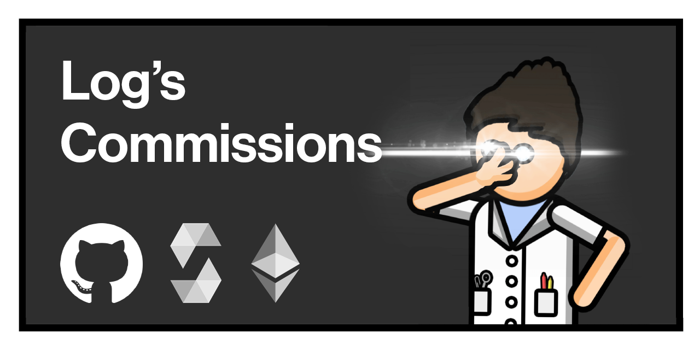

# What is this? 
This is a repository containing contracts people have commissioned me to code.
Every contract is fully explained with comments, error messages, and easy syntax. Someone who has no experience with coding should be able to understand the logic behind my contracts. So check them out!

Feel free to deploy some of these and test them yourself! All contracts are usable from an etherscan interface.

You are free to use these contracts yourself, but make sure to follow the rules of the license I put in each one of them. There is a TL;DR of the license at the top of every contract.

# How to commission a contract:
If you need a contract coded, I’m your guy!

The only think I ask of you is to explain exactly what you want. Asking me to create a token with no other context doesn’t really mean anything. A contract has buttons and logic; and you have to tell me what exactly you want those buttons to do or give me a general idea on what you want those buttons to be used for. 

Compensation is based on the difficulty and amount of time it would take to finish coding.

To request a commission, please DM me on discord at Log#7730

(and if you were wondering, all the animations in this repository are made by me!)
